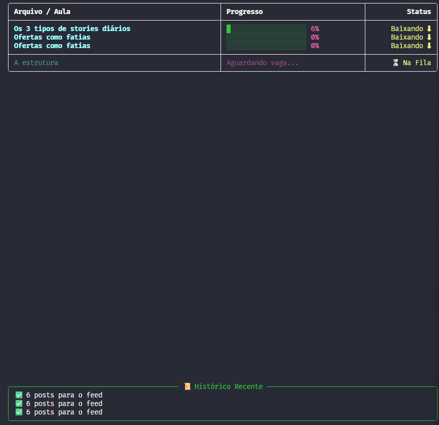

<div align="center">

# 🚀 Loom Downloader - Skool Edition

**Uma ferramenta poderosa para baixar, organizar e converter aulas do Loom diretamente da plataforma Skool.**


[Funcionalidades](#-funcionalidades) • [Pré-requisitos](#-pré-requisitos) • [Instalação](#-instalação) • [Como Usar](#-como-usar)

</div>

---

## 📖 Sobre o Projeto

Este projeto nasceu da necessidade de baixar aulas hospedadas no Loom dentro de comunidades do Skool para visualização offline. Diferente de baixadores comuns, este sistema é **híbrido**:

1.  Uma **Extensão do Chrome** injeta um botão de download diretamente no player de vídeo.
2.  Um **Servidor Python** local recebe o pedido, baixa os fragmentos `.ts` em alta velocidade, converte para `.mp4` e organiza tudo automaticamente.

> **Nota:** Este projeto é para fins educacionais e de uso pessoal (backup de cursos adquiridos).

---

## ✨ Funcionalidades

* **⚡ Download Multi-thread:** Baixa múltiplos fragmentos do vídeo simultaneamente para máxima velocidade.
* **🧠 Inteligente:** Detecta automaticamente o nome da Comunidade, do Curso e da Aula para criar as pastas.
* **🛡️ Proteção contra Duplicatas:** Verifica se o arquivo já existe antes de iniciar, poupando tempo e banda.
* **🎬 Conversão Automática:** Une e converte os segmentos `.ts` para um arquivo `.mp4` limpo usando FFmpeg.
* **🖥️ Dashboard Visual:** Interface rica no terminal para acompanhar o progresso em tempo real (via biblioteca `rich`).
* **📂 Organização Automática:**
    ```text
    output/
    └── Nome da Comunidade/
        └── Nome do Curso/
            └── Aula 01 - Título.mp4
    ```

---

## 🛠 Pré-requisitos

Antes de começar, precisas ter instalado na tua máquina:

1.  **Python 3.10+**: [Baixar aqui](https://www.python.org/)
2.  **FFmpeg**: Essencial para a conversão de vídeo.
    * *Windows:* [Tutorial de Instalação](https://phoenixnap.com/kb/ffmpeg-windows) (Não esqueça de adicionar ao PATH).
    * *Mac:* `brew install ffmpeg`
    * *Linux:* `sudo apt install ffmpeg`
3.  **Google Chrome** (ou navegador baseado em Chromium, como Edge/Brave).

---

## 🚀 Instalação

### Passo 1: Configurar o Servidor (Backend)

1.  Clone este repositório:
    ```bash
    git clone [https://github.com/SEU-USUARIO/loom-downloader-tool.git](https://github.com/SEU-USUARIO/loom-downloader-tool.git)
    cd loom-downloader-tool
    ```

2.  Crie um ambiente virtual (recomendado) e instale as dependências:
    ```bash
    # Criar venv
    python -m venv venv

    # Ativar venv (Windows)
    venv\Scripts\activate
    # Ativar venv (Mac/Linux)
    source venv/bin/activate

    # Instalar pacotes
    pip install -r requirements.txt
    ```

### Passo 2: Instalar a Extensão (Frontend)

1.  Abra o Chrome e vá para `chrome://extensions`.
2.  Ative o **"Modo do desenvolvedor"** (canto superior direito).
3.  Clique em **"Carregar sem compactação"** (Load unpacked).
4.  Selecione a pasta `extension` dentro deste projeto.

---

## 🕹 Como Usar

1.  **Inicie o Servidor:**
    No terminal, dentro da pasta do projeto, rode:
    ```bash
    python server/app.py
    ```
    *Você verá o Dashboard iniciar e a mensagem de que o servidor está rodando na porta 5000.*

2.  **Vá para o Skool:**
    Acesse a aula que deseja baixar no seu navegador.

3.  **Baixe:**
    Um botão verde **"⬇ Baixar Aula"** aparecerá no canto superior direito do vídeo.
    * Clique nele. O botão mudará para "⏳ Na Fila".
    * Olhe para o seu terminal para ver o download acontecer!

---

## 📸 Screenshots

**

---

## 🤝 Contribuição

Contribuições são bem-vindas! Se tens uma ideia para melhorar o código:

1.  Faça um Fork do projeto.
2.  Crie uma Branch para sua Feature (`git checkout -b feature/Incrível`).
3.  Faça o Commit (`git commit -m 'Add some Incrível'`).
4.  Faça o Push (`git push origin feature/Incrível`).
5.  Abra um Pull Request.

---

<div align="center">

Feito com 💜 e Python por [Eduardo Ribeiro](https://github.com/duribeiro)

</div>