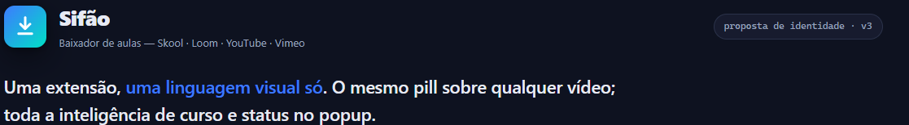
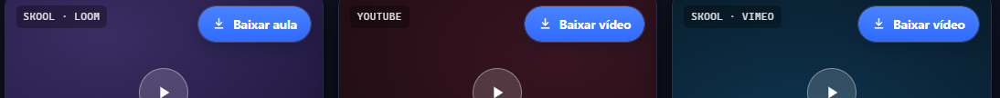
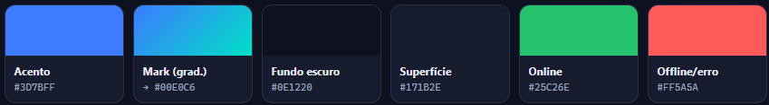

<div align="center">


# Sifão — Baixador de aulas

**Baixe, organize e converta cursos inteiros do Skool (Loom, Vimeo, YouTube e vídeo do próprio Skool) — com texto e anexos, direto do player, com um clique.**


[Funcionalidades](#-funcionalidades) • [Instalação](#-instalação) • [Como usar](#-como-usar) • [Organização](#-organização-dos-arquivos) • [Design](#-identidade-visual)



</div>

---

## 📖 Sobre o projeto

Baixador de aulas hospedadas em comunidades do **Skool** — seja qual for onde o vídeo mora (**Loom**, **Vimeo**, **YouTube** ou a infra do **próprio Skool**) — e de vídeos avulsos dessas plataformas, para assistir offline. Uma aula não é só o vídeo: o Sifão também salva o **texto** da aula (`.md`) e os **arquivos anexos**. A arquitetura é **híbrida**:

1. Uma **extensão do Chrome** injeta um botão de download no player — o mesmo componente em qualquer vídeo — e, pelo popup, enfileira um **curso** ou a **comunidade inteira**.
2. Um **servidor Python local** recebe os pedidos, baixa (HLS em paralelo ou via `yt-dlp`), converte para `.mp4` com FFmpeg e organiza tudo em pastas.

> **Uso pessoal/educacional:** backup de cursos que você adquiriu. Respeite os termos das plataformas e os direitos dos autores.

---

## ✨ Funcionalidades

- **🎯 Um pill para tudo** — o mesmo botão sobre o vídeo no **Loom**, **YouTube**, **Vimeo** e no player do **próprio Skool** (estilo Internet Download Manager). Só o rótulo muda.
- **📚 Curso inteiro pelo popup** — na classroom do Skool, o popup detecta o curso da aba e enfileira **todas as aulas** de uma vez (vídeo + texto + anexos), respeitando a estrutura de módulos.
- **🏘️ Comunidade inteira** — na listagem `/{grupo}/classroom`, o popup lista os cursos, mostra o total de aulas na hora e enfileira tudo com **confirmação em dois passos**. Cursos sem acesso são pulados e reportados.
- **🎥 5 fontes** — Skool/Loom (HLS próprio), **vídeo hospedado no Skool** (Mux, via `yt-dlp`), YouTube e Vimeo (`yt-dlp`), incluindo **Vimeo privado** do Skool (via `Referer`) e **Loom direto** (`loom.com/share`).
- **📝 Texto e anexos da aula** — a descrição e os recursos viram um `.md` em Markdown (links, listas, negrito); os arquivos anexos (`file_id` do Skool) são baixados de verdade. Aula sem vídeo não é omitida: vira `.md`.
- **📁 Uma pasta por aula** — a partir de **2 arquivos** (mp4 + md + anexos) a aula ganha pasta própria; com um só, o arquivo fica solto no módulo.
- **📁 YouTube por canal** — vídeos do YouTube **colados no popup** caem em `output/YouTube/<Canal>/`. Aula do Skool cujo vídeo mora no YouTube **não** ganha esse nível — ela segue a estrutura do curso.
- **🧠 Caminho correto + dedup** — cada aula grava no caminho completo (Comunidade/Curso/Módulo) e o que já existe é **pulado**.
- **⚡ Download paralelo** — 12 threads por aula nos fragmentos HLS e **4 aulas simultâneas** por padrão (número medido, ajustável por `SIFAO_DOWNLOADS_SIMULTANEOS`). Enfileiramento de curso resiliente a recarregar a página.
- **🔁 Retry com backoff** — cada requisição HLS tem timeout e até **3 tentativas**; segmento que falha de vez é reportado, não engolido.
- **🖥️ Dashboard no terminal** — progresso em tempo real, por curso e por módulo, com ETA calculado pelo ritmo observado (biblioteca `rich`).
- **🟢 Status do servidor** — o popup mostra se o servidor local está online.

---

## 🖼️ Visão geral

**O mesmo pill sobre qualquer player:**



**Dashboard no terminal (progresso em tempo real):**


> ⚠️ **Screenshot desatualizado** (é da v3). O painel atual traz, de cima para baixo: faixa da marca, **Progresso Geral** (concluídas / erros / baixando / na fila + barra + ETA), tabela de **Cursos** (módulo atual e quanto falta de cada um), **Baixando agora** e o histórico. Ele também se adapta à altura do terminal — se não couber, o histórico sai primeiro.

> Veja o mockup interativo (claro/escuro) do sistema visual em [`docs/design-system/mockup.html`](docs/design-system/mockup.html).

---

## 🛠 Pré-requisitos

1. **Python 3.10+** — [python.org](https://www.python.org/)
2. **FFmpeg** no PATH — obrigatório para converter/fundir vídeo.
   - *Windows:* [tutorial](https://phoenixnap.com/kb/ffmpeg-windows) (adicione ao PATH)
   - *macOS:* `brew install ffmpeg`
   - *Linux:* `sudo apt install ffmpeg`
3. **Google Chrome** (ou Edge/Brave — Chromium).

> "O servidor não sobe" é quase sempre FFmpeg fora do PATH: `verificar_ffmpeg()` faz `sys.exit(1)` se não encontrar.

---

## 🚀 Instalação

### 1. Servidor (backend)

**Windows (PowerShell):**
```powershell
git clone https://github.com/duribeiro/loom-downloader-tool.git
cd loom-downloader-tool
.\setup.ps1
```

**Linux / macOS:**
```bash
git clone https://github.com/duribeiro/loom-downloader-tool.git
cd loom-downloader-tool
./setup.sh
```

O script verifica Python e FFmpeg, cria o `venv` e instala tudo. É **idempotente** (pode rodar várias vezes) e nunca apaga um `venv` existente. Se faltar um pré-requisito, ele para com a instrução exata do que instalar.

> **Windows:** o `.\` é obrigatório. Se der erro de política de execução (arquivo veio de `.zip`), rode `Unblock-File .\setup.ps1` antes.

### 2. Extensão (frontend) — manual

O Chrome não permite automatizar este passo:

1. Abra `chrome://extensions`
2. Ative o **"Modo do desenvolvedor"** (canto superior direito)
3. Clique em **"Carregar sem compactação"**
4. Selecione a pasta **`extension`** deste projeto

> O caminho completo é impresso pelo `setup.ps1` no final — é só copiar.

---

## 🕹 Como usar

**1. Inicie o servidor** — no terminal, **de dentro de `loom-downloader-tool/`**:

```powershell
# Windows
.\venv\Scripts\python.exe server\app.py
```
```bash
# Linux / macOS
./venv/bin/python server/app.py
```

Sobe em `localhost:5000` com o dashboard no terminal.

> **A pasta importa:** `PASTA_TEMP_RAIZ` é relativo ao diretório atual — rode de dentro de `loom-downloader-tool/`.

**2. Baixe** — de acordo com o que você quer:

| Quero baixar… | O que fazer |
|---|---|
| **Uma aula do Skool/Loom** | Abra a aula → clique no pill **⬇ Baixar aula** sobre o vídeo |
| **Uma aula com vídeo do próprio Skool** | Abra a aula → pill **⬇ Baixar vídeo** sobre o player (resolve o token no clique) |
| **Um curso inteiro do Skool** | Na classroom → clique no ícone da extensão → **📚 Baixar curso inteiro** |
| **Todos os cursos da comunidade** | Em `skool.com/{grupo}/classroom` → ícone da extensão → **Baixar todos os cursos** → confirmar |
| **Um vídeo do YouTube** | Abra o vídeo → pill **⬇ Baixar vídeo** sobre o player |
| **Um link avulso (YouTube/Loom/Vimeo)** | Clique no ícone da extensão → **colar link** → **Baixar** |
| **Um Vimeo (post do Skool)** | Abra o post → pill **⬇ Baixar vídeo** sobre o vídeo |
| **Um Loom direto** | Abra `loom.com/share/...` → pill sobre o player |

Acompanhe o progresso no **dashboard do terminal**.

> **Curso/comunidade: deixe a aba aberta.** O enfileiramento roda no content script (sobrevive a fechar o popup, mas não a fechar a aba). Se você tentar recarregar no meio, o navegador avisa.

**3. Quer mais (ou menos) downloads ao mesmo tempo?**

```powershell
$env:SIFAO_DOWNLOADS_SIMULTANEOS = 6 ; .\venv\Scripts\python.exe server\app.py
```

O padrão é **4** — número **medido**, não chutado: 19,8% mais rápido que 1 e 2,5% mais rápido que 8, que ainda travou uma rodada. Metodologia e números em [`plan/feito/benchmark-concorrencia.md`](plan/feito/benchmark-concorrencia.md).

> **Registro do projeto:** [`plan/`](plan/) guarda medições, decisões e pendências, separado em [`a-fazer/`](plan/a-fazer/) e [`feito/`](plan/feito/). O índice está em [`plan/README.md`](plan/README.md).

---

## 📂 Organização dos arquivos

Mesma lógica em todas as fontes: `output/<Origem>/<Agrupador>/<Aula>`.

**A regra da pasta por aula:** uma aula que gera **2 ou mais arquivos** (vídeo + texto + anexos) ganha uma pasta com o nome dela; uma aula com **um arquivo só** fica solta no módulo — pasta com um arquivo dentro é ruído.

```text
output/
├── AI Makers Club/                        ← comunidade Skool
│   └── Bootcamp Mês 1/                    ← curso
│       └── Dia 1/                         ← módulo
│           ├── Boas-vindas.mp4            ← aula de um arquivo só: fica solta
│           └── Montando o agente/         ← aula com 2+ arquivos: pasta própria
│               ├── Montando o agente.mp4
│               ├── Montando o agente.md   ← descrição + recursos da aula
│               └── workflow.json          ← anexo
└── YouTube/
    └── Hashtag Treinamentos/              ← canal (via yt-dlp), só para link colado
        └── Aula 1 - Criando agentes de IA.mp4
```

> Já tem uma biblioteca no layout antigo? `python migrar_layout.py` mostra o que faria; `--executar` faz. Ele é idempotente e nunca sobrescreve.

---

## 🎨 Identidade visual

A extensão segue um design system próprio — **Sifão** — documentado em [`docs/design-system/`](docs/design-system/README.md):



- **Um acento** (azul-elétrico `#3D7BFF`) e um mark em gradiente, em toda a extensão.
- **Cores semânticas** (online/erro) separadas da marca.
- **Um só componente** de download (pill) sobre qualquer player.
- Ícone próprio gerado por [`tools/gerar_icones.py`](tools/gerar_icones.py) a partir do design system.

---

## 🧪 Testes

```powershell
.\venv\Scripts\python.exe -m pip install -r requirements-dev.txt
.\venv\Scripts\python.exe -m pytest          # rápido, sem internet
.\venv\Scripts\python.exe -m pytest -m rede  # bate no Loom de verdade
```

São **dois tipos de teste** com propósitos diferentes:

| | O que protege | Quando roda |
|---|---|---|
| **Suíte padrão** | Contra **nós** quebrarmos o código | Sempre. Fixtures congeladas, sem internet |
| **`-m rede`** | Contra o **Loom** mudar a página | Sob demanda. Precisa de internet |

Uma fixture congelada fica verde para sempre mesmo se o Loom mudar o formato da página — projeto quebrado, suíte passando. **Se um teste `-m rede` falhar, não é bug — é manutenção:** o Loom mudou algo. Baixe o HTML novo e atualize a extração junto com a fixture em `tests/fixtures/loom_embed.html`.

---

## 🧰 Manutenção da biblioteca

Scripts na raiz do projeto, fora do servidor. **Os três simulam por padrão** — só agem com `--executar`:

| Script | Para quê |
|---|---|
| `migrar_layout.py` | Reorganiza uma `output/` antiga para o layout de **pasta por aula**. Idempotente: não cria `Aula X/Aula X/` a cada rodada. |
| `reparar_pastas_canal.py` | Remove as pastas de **canal do YouTube** que se infiltraram na árvore de cursos antes da 4.0. Não adivinha: compara com a estrutura real do Skool, medida na API. |
| `bench_concorrencia.py` | Mede o tempo real por nível de concorrência baixando as mesmas aulas em `output/_BENCH`. Foi o que definiu o padrão 4. |

`output/_BENCH` e `output/_DUPLICADOS` são pastas de serviço e ficam de fora da migração.

---

## 🧩 Como funciona (resumo)

1. **Extensão** → `POST localhost:5000/baixar` com `{url, folder, filename[, desc, resources, referer, anexos]}`. `url` vazia é caso válido: aula só de texto.
2. **Servidor** responde `200` na hora e joga o download num `ThreadPoolExecutor` (4 simultâneos por padrão).
3. **O worker grava texto e anexos ANTES do vídeo** — em curso onde o anexo é o produto, ele não pode depender do vídeo dar certo.
4. **Roteamento por URL:** YouTube, Vimeo e vídeo do Skool (Mux) → `yt-dlp`; Loom/embed → extrai o `.m3u8` e baixa o HLS.
5. **Loom (HLS):** escolhe a maior qualidade, baixa vídeo + áudio com 12 threads (timeout + 3 tentativas cada), funde com FFmpeg (`-c copy`).
6. **Organização:** grava em `output/…` seguindo a estrutura de comunidade/curso/módulo, com pasta por aula quando há 2+ arquivos.

---

## ⚠️ Limitações conhecidas

- **Falha de segmento não vira erro:** cada fragmento HLS tem timeout e 3 tentativas com backoff, e o que falha de vez é contado e reportado — mas o vídeo é convertido mesmo assim e a aula ainda aparece como **sucesso** no dashboard. O aviso sai no terminal, e o painel do `rich` repinta a tela 4×/s por cima dele.
- **Limiar de 1 MB:** um `.mp4` truncado acima de 1 MB é considerado "completo" e não é rebaixado.
- **Sem cancelamento:** depois de enfileirado, um download só para matando o processo (`Ctrl+C`).
- **Token do Skool expira (~24h):** a extensão resolve o token no enfileiramento. Fila muito longa pode alcançar a expiração — o servidor detecta e diz o que fazer (reenfileirar o curso; o que já baixou é pulado), mas não renova sozinho, porque ele não tem a sessão do Skool.
- **Curso sem acesso não tem vídeo:** o Skool devolve a estrutura, mas remove os links no servidor. Esses cursos são pulados e listados no popup.

---

## 🤝 Contribuição

1. Faça um fork
2. Crie uma branch (`git checkout -b feature/minha-feature`)
3. Commit (`git commit -m 'feat: minha feature'`)
4. Push (`git push origin feature/minha-feature`)
5. Abra um Pull Request

---

<div align="center">

Feito com 💜 e Python por [Eduardo Ribeiro](https://github.com/duribeiro)

</div>
